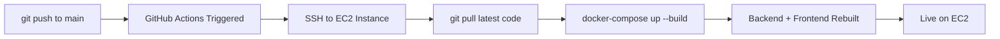

# 💰 FinanceAdvisor — AI-Powered Personal Finance System

> A production-ready, full-stack AI-powered personal finance application built with **.NET 8 + React (Vite)**, featuring a **two-agent architecture**, **session management**, **transaction editing**, and **enhanced AI capabilities** — deployed end-to-end on AWS at **zero cost**.

[](https://dotnet.microsoft.com/)
[](https://reactjs.org/)
[](https://aws.amazon.com/rds/)
[](https://aws.amazon.com/ec2/)
[](https://www.docker.com/)

---

## 🌐 Live Deployment Architecture

| Component | Service | Details |
|-----------|---------|---------|
| **Frontend** | React (Vite) + Nginx | Docker on **AWS EC2 (Free Tier)** |
| **Backend** | ASP.NET Core (.NET 8) | Docker on **AWS EC2 (Free Tier)** |
| **Database** | **Amazon RDS PostgreSQL** | db.t3.micro (Free Tier) |
| **AI Engine** | **Groq API** (LLaMA-3) | Free Plan |
| **CI/CD** | **GitHub Actions** | Auto-deploy on push to `main` |
| **Secrets** | `.env` file | Stored on EC2 (not in repo) |

> ✅ **Fully automated deployment** — every `git push` to `main` triggers GitHub Actions → SSH to EC2 → `git pull` → `docker-compose up --build`

---

## 🎯 Key Features

### 🔐 **Advanced Session Management**
- **Concurrent login detection** — alerts users when another session is active
- **Force logout other sessions** — checkbox option to terminate other active sessions
- **5-minute idle timeout** — automatic logout after inactivity
- **Session tracking** — stores session tokens with last activity timestamps in database

### 💳 **Transaction Management**
- **Add transactions** with amount, category, description, date, and recurring flag
- **Edit existing transactions** — full CRUD operations with inline editing
- **7 spending categories** — Food, Transport, Entertainment, Utilities, Healthcare, Shopping, Other
- **Recurring transaction tracking** — identifies subscription-like expenses

### 🤖 **Enhanced AI Financial Advisor**
- **Latest transaction queries** — "What is my latest transaction?"
- **Amount-based filtering** — "Show me all transactions above ₹2000"
- **Range queries** — "Transactions between ₹1000 and ₹5000"
- **Context-aware responses** — AI receives last 10 transactions for better insights
- **Natural language understanding** — powered by Groq LLaMA-3

### 📊 **Financial Insights Dashboard**
- **Interactive charts** — spending by category with Recharts
- **Month-over-month comparison** — percentage deltas for each category
- **Top spending category** — identifies your biggest expense area
- **Smart alerts** — rules engine detects spending spikes and budget warnings

### 🔒 **Security Features**
- **JWT authentication** — secure token-based auth with 8-hour expiration
- **Password hashing** — SHA-256 for secure credential storage
- **Protected routes** — all API endpoints require authentication
- **CORS configuration** — restricted to allowed origins

---

## 🏗️ System Architecture

```
┌─────────────────────────────────────────────────────────────┐
│                      AWS EC2 Instance                        │
│  ┌────────────────────┐         ┌─────────────────────┐    │
│  │   Nginx (Docker)   │         │  .NET 8 API (Docker)│    │
│  │   React Frontend   │────────▶│   Port 8080         │    │
│  │   Port 80          │         └──────────┬──────────┘    │
│  └────────────────────┘                    │                │
└────────────────────────────────────────────┼────────────────┘
                                             │
                                             ▼
                          ┌──────────────────────────────────┐
                          │      Amazon RDS PostgreSQL       │
                          │       (Free Tier Instance)       │
                          └──────────────────────────────────┘
                                             │
                          ┌──────────────────┴─────────────┐
                          │                                 │
                    ┌─────▼──────┐                  ┌──────▼──────┐
                    │   Agent 1   │                  │   Agent 2   │
                    │ Rules Engine│                  │  AI Advisor │
                    │ (Deterministic)                │  (Groq LLM) │
                    └─────────────┘                  └─────────────┘
```

### 🧠 Two-Agent Architecture Explained

**Why separate agents?** Most AI finance apps pass raw transaction data directly to an LLM, leading to hallucinated numbers and incorrect calculations.

#### **Agent 1: Data Processor & Rules Engine** (Deterministic)
- Aggregates transactions by category and time period
- Calculates totals, averages, and month-over-month deltas
- Applies business rules (spending spikes, budget warnings)
- Outputs structured, validated JSON
- **Zero AI involvement** — pure arithmetic and logic

#### **Agent 2: Financial Advisor** (LLM-Powered)
- Receives **only** pre-computed, validated data from Agent 1
- Never accesses raw transactions or performs calculations
- Generates natural language insights and recommendations
- Answers user questions using structured context
- Powered by **Groq LLaMA-3** for fast, accurate responses

**Result:** 100% accurate financial figures + natural, helpful AI explanations.

---

## ⚙️ Technology Stack

### **Backend**
- **Framework:** ASP.NET Core 8.0 (C#)
- **Architecture:** Clean Architecture (Domain, Application, Infrastructure, API)
- **ORM:** Entity Framework Core 8.0
- **Database:** PostgreSQL (via Npgsql)
- **Authentication:** JWT Bearer Tokens
- **AI Integration:** Groq API (LLaMA-3-70B)
- **Validation:** Data Annotations + Custom Middleware

### **Frontend**
- **Framework:** React 18.2
- **Build Tool:** Vite 5.1
- **Styling:** Tailwind CSS 3.4
- **Routing:** React Router DOM 6.22
- **HTTP Client:** Axios 1.6
- **Charts:** Recharts 2.12
- **Icons:** Lucide React 0.344

### **DevOps & Infrastructure**
- **Containerization:** Docker + Docker Compose
- **Web Server:** Nginx (production)
- **CI/CD:** GitHub Actions
- **Cloud Provider:** AWS (EC2 + RDS)
- **Secrets Management:** `.env` file on EC2

---

## 📁 Project Structure

```
FinanceAdvisor/
├── .github/
│   └── workflows/
│       └── deploy.yml                    # GitHub Actions CI/CD pipeline
│
├── frontend/                             # React + Vite application
│   ├── src/
│   │   ├── api/
│   │   │   └── client.js                 # Axios config + API clients
│   │   ├── components/
│   │   │   └── Layout.jsx                # Sidebar navigation
│   │   ├── context/
│   │   │   └── AuthContext.jsx           # Auth state + session management
│   │   ├── pages/
│   │   │   ├── Login.jsx                 # Login + session alert modal
│   │   │   ├── Dashboard.jsx             # Insights + charts
│   │   │   ├── Transactions.jsx          # CRUD transactions + editing
│   │   │   └── Chat.jsx                  # AI advisor chat interface
│   │   ├── App.jsx                       # Routes + protected routes
│   │   └── main.jsx                      # Entry point
│   ├── Dockerfile                        # Nginx production build
│   ├── package.json
│   ├── vite.config.js
│   └── tailwind.config.js
│
├── src/                                  # .NET 8 Backend (Clean Architecture)
│   ├── FinanceAdvisor.API/
│   │   ├── Controllers/
│   │   │   ├── AuthController.cs         # Login, session check, logout
│   │   │   ├── TransactionsController.cs # CRUD + edit + filtering
│   │   │   ├── InsightsController.cs     # Financial summaries
│   │   │   └── AgentController.cs        # AI query orchestration
│   │   ├── Middleware/
│   │   │   └── ExceptionMiddleware.cs    # Global error handling
│   │   ├── Program.cs                    # DI, JWT, CORS, Swagger
│   │   └── appsettings.json              # Configuration template
│   │
│   ├── FinanceAdvisor.Application/
│   │   ├── DTOs/
│   │   │   └── DTOs.cs                   # Request/response models
│   │   ├── Interfaces/
│   │   │   └── IServices.cs              # Service contracts
│   │   ├── Models/
│   │   │   └── Models.cs                 # Domain models, alerts
│   │   └── Services/
│   │       └── RulesEngineService.cs     # Agent 1: Rules evaluation
│   │
│   ├── FinanceAdvisor.Domain/
│   │   ├── Entities/
│   │   │   ├── User.cs                   # User entity + sessions
│   │   │   ├── Transaction.cs            # Transaction entity
│   │   │   └── UserSession.cs            # Session tracking entity
│   │   └── Enums/
│   │       └── Category.cs               # Spending categories
│   │
│   └── FinanceAdvisor.Infrastructure/
│       ├── Data/
│       │   └── AppDbContext.cs           # EF Core context + seeding
│       ├── Services/
│       │   ├── AuthService.cs            # JWT + session management
│       │   ├── TransactionService.cs     # Transaction CRUD + filtering
│       │   ├── InsightsService.cs        # Financial aggregations
│       │   └── AIService.cs              # Agent 2: Groq integration
│       └── External/
│           └── GroqClient.cs             # HTTP client for Groq API
│
├── docker-compose.yml                    # Orchestrates backend + frontend
├── Dockerfile                            # Backend multi-stage build
├── FinanceAdvisor.sln                    # Solution file
├── setup.sh                              # Linux setup script
├── setup.bat                             # Windows setup script
├── .gitignore                            # Git ignore rules
└── .env                                  # Secrets (EC2 only, not in repo)
```

---

## 🚀 CI/CD Pipeline

### GitHub Actions Workflow



**Workflow Steps:**
1. Developer pushes code to `main` branch
2. GitHub Actions workflow starts
3. Connects to EC2 via SSH (using stored secret key)
4. Pulls latest code from repository
5. Runs `docker-compose up --build` to rebuild containers
6. New version goes live automatically

**Configuration:**
- SSH key stored as GitHub repository secret
- `.env` file with secrets already on EC2 (never in repo)
- Zero manual intervention required

---

## 🔐 Environment Variables

All sensitive configuration is stored in a `.env` file on the EC2 instance. **This file is NEVER committed to source control.**

### `.env` File Structure

```env
# Database Connection (Amazon RDS PostgreSQL)
ConnectionStrings__DefaultConnection=Host=your-rds-endpoint.rds.amazonaws.com;Port=5432;Database=financeadvisor;Username=postgres;Password=your_db_password

# Groq AI API
Groq__ApiKey=gsk_your_groq_api_key_here

# JWT Authentication
Jwt__Key=your_super_secret_jwt_key_at_least_32_characters_long
Jwt__Issuer=FinanceAdvisorAPI
Jwt__Audience=FinanceAdvisorClient
```

### How It Works

The `docker-compose.yml` automatically loads the `.env` file:

```yaml
services:
  backend:
    build: .
    ports:
      - "5000:8080"
    env_file:
      - .env    # ← Loads all environment variables
```

---

## 💻 Local Development Setup

### Prerequisites

- [.NET 8 SDK](https://dotnet.microsoft.com/download/dotnet/8.0)
- [Node.js 18+](https://nodejs.org/) and npm
- [PostgreSQL 14+](https://www.postgresql.org/download/) (local or Docker)
- [Groq API Key](https://console.groq.com/) (free tier available)

### 1. Clone the Repository

```bash
git clone https://github.com/mustaaf21/FinanceAdvisor.git
cd FinanceAdvisor
```

### 2. Set Up PostgreSQL Database

```bash
# Using Docker (recommended)
docker run --name postgres-dev -e POSTGRES_PASSWORD=yourpassword -p 5432:5432 -d postgres:14

# Or install PostgreSQL locally and create database
createdb financeadvisor
```

### 3. Configure Environment Variables

Create a `.env` file in the root directory (for local development):

```env
ConnectionStrings__DefaultConnection=Host=localhost;Port=5432;Database=financeadvisor;Username=postgres;Password=yourpassword
Groq__ApiKey=your_groq_api_key
Jwt__Key=your_local_jwt_secret_key_at_least_32_chars
Jwt__Issuer=FinanceAdvisorAPI
Jwt__Audience=FinanceAdvisorClient
```

### 4. Run the Backend

```bash
# Restore dependencies
dotnet restore

# Run migrations (creates tables)
dotnet ef database update --project src/FinanceAdvisor.Infrastructure --startup-project src/FinanceAdvisor.API

# Start the API
dotnet run --project src/FinanceAdvisor.API

# API will be available at: http://localhost:8080
# Swagger UI: http://localhost:8080/swagger
```

### 5. Run the Frontend

```bash
cd frontend

# Install dependencies
npm install

# Start development server
npm run dev

# Frontend will be available at: http://localhost:5173
```

### 6. Access the Application

- **Frontend:** http://localhost:5173
- **Backend API:** http://localhost:8080
- **Swagger Docs:** http://localhost:8080/swagger


---

## 🐳 Docker Deployment (Full Stack)

### Quick Start

```bash
# 1. Create .env file with your secrets (see Environment Variables section)
nano .env

# 2. Build and run both services
docker-compose up --build

# 3. Access the application
# Frontend: http://localhost
# Backend API: http://localhost:5000
```

### Docker Services

- **Backend:** .NET 8 API running on port 8080 (mapped to 5000)
- **Frontend:** React app served by Nginx on port 80

### Stopping Services

```bash
docker-compose down
```

---

## 📡 API Endpoints

### Authentication

| Method | Endpoint | Description | Auth Required |
|--------|----------|-------------|---------------|
| `POST` | `/api/auth/login` | Login with email/password, returns JWT | No |
| `POST` | `/api/auth/check-session` | Check if user has active session | No |
| `POST` | `/api/auth/logout-session` | Logout specific session by ID | No |

### Transactions

| Method | Endpoint | Description | Auth Required |
|--------|----------|-------------|---------------|
| `GET` | `/api/transactions` | Get all user transactions | Yes |
| `POST` | `/api/transactions` | Create new transaction | Yes |
| `PUT` | `/api/transactions/{id}` | Update existing transaction | Yes |
| `GET` | `/api/transactions/latest` | Get most recent transaction | Yes |
| `GET` | `/api/transactions/by-amount` | Filter by amount range | Yes |

### Insights

| Method | Endpoint | Description | Auth Required |
|--------|----------|-------------|---------------|
| `GET` | `/api/insights` | Get financial summary + alerts | Yes |

### AI Agent

| Method | Endpoint | Description | Auth Required |
|--------|----------|-------------|---------------|
| `POST` | `/api/agent/query` | Ask AI advisor a question | Yes |

---

## 🤖 AI Capabilities

### What You Can Ask

The AI Financial Advisor understands natural language queries about your finances:

#### Transaction Queries
- "What is my latest transaction?"
- "Show me my last 5 transactions"
- "What did I spend on food this month?"

#### Amount-Based Filtering
- "Show me all transactions above ₹2000"
- "Transactions between ₹1000 and ₹5000"
- "What are my biggest expenses?"

#### Financial Insights
- "How is my spending this month?"
- "Am I spending more than last month?"
- "What category am I spending the most on?"
- "Do I have any spending alerts?"

#### Recommendations
- "How can I reduce my spending?"
- "What should I focus on to save money?"
- "Are there any unusual patterns in my spending?"

### How It Works

1. **User asks question** → Frontend sends to `/api/agent/query`
2. **Agent 1 (Rules Engine)** → Processes transactions, calculates insights
3. **Agent 2 (AI Advisor)** → Receives structured data + user question
4. **Groq LLaMA-3** → Generates natural language response
5. **Response returned** → Includes answer, alerts, and summary

---

## 🛡️ Security Features

### Authentication & Authorization
- **JWT Bearer Tokens** with 8-hour expiration
- **SHA-256 password hashing** for secure credential storage
- **Protected routes** — all API endpoints require valid JWT
- **Session tracking** — monitors active sessions per user

### Session Management
- **Concurrent login detection** — alerts when multiple sessions exist
- **5-minute idle timeout** — automatic logout after inactivity
- **Real-time force logout** — immediately invalidates other sessions when user forces logout
- **Session validation middleware** — validates session on every API request
- **Automatic session termination** — logged-out users are kicked out on their next API call
- **Activity tracking** — updates last activity timestamp on each request
- **Custom event handling** — graceful logout with user notification

### Data Protection
- **CORS restrictions** — only allowed origins can access API
- **Environment variables** — secrets never committed to repository
- **SQL injection prevention** — Entity Framework parameterized queries
- **Exception middleware** — sanitized error messages in production

---

## 📊 Rules Engine

The deterministic rules engine evaluates financial data and generates alerts:

### Rule 1: Spending Spike Detection
- **Trigger:** Category spending increased >20% month-over-month
- **Severity:** Medium (20-50%), High (>50%)
- **Example:** "Food spending increased by 35% compared to last month"

### Rule 2: Budget Warning
- **Trigger:** Total monthly spending exceeds ₹50,000
- **Severity:** High
- **Example:** "Total monthly spend of ₹62,000 exceeds recommended threshold"

### Rule 3: Unusual Activity
- **Trigger:** Overall spending up >30% from last month
- **Severity:** Medium
- **Example:** "Overall spending up 42% from last month — review your budget"

---

## ☁️ AWS Free Tier Deployment

### Cost Breakdown (100% Free)

| Service | Instance Type | Free Tier Limit | Monthly Cost |
|---------|---------------|-----------------|--------------|
| **EC2** | t2.micro | 750 hours/month | **$0** |
| **RDS PostgreSQL** | db.t3.micro | 750 hours/month | **$0** |
| **RDS Storage** | General Purpose SSD | 20 GB | **$0** |
| **Data Transfer** | Outbound | 15 GB | **$0** |
| **Groq API** | LLaMA-3-70B | Free Plan | **$0** |
| **GitHub Actions** | CI/CD Minutes | 2000 min/month | **$0** |
| **Total** | | | **$0** |

### Setup Instructions

1. **Launch EC2 Instance** (t2.micro, Ubuntu 22.04)
2. **Create RDS PostgreSQL** (db.t3.micro, Free Tier)
3. **Install Docker & Docker Compose** on EC2
4. **Clone repository** to EC2
5. **Create `.env` file** with RDS connection string
6. **Run `docker-compose up -d`**
7. **Configure GitHub Actions** with EC2 SSH key

---

## 🎨 Frontend Features

### Pages

#### 1. **Login Page**
- Email/password authentication
- Password visibility toggle
- Session conflict modal with force logout option
- Responsive design with modern UI

#### 2. **Dashboard**
- Total spending (current + last month)
- Top spending category
- Active alerts with severity indicators
- Interactive bar chart (spending by category)
- Month-over-month comparison table

#### 3. **Transactions Page**
- List all transactions (table on desktop, cards on mobile)
- Add new transaction form
- **Edit existing transactions** (inline editing)
- Filter by category
- Recurring transaction badges
- Refresh button

#### 4. **AI Advisor Chat**
- Conversational interface
- Suggested questions
- Real-time AI responses
- Alert display
- Chat history

---

## 🔧 Development Scripts

### Backend

```bash
# Build solution
dotnet build

# Run tests (if any)
dotnet test

# Create migration
dotnet ef migrations add MigrationName --project src/FinanceAdvisor.Infrastructure --startup-project src/FinanceAdvisor.API

# Apply migrations
dotnet ef database update --project src/FinanceAdvisor.Infrastructure --startup-project src/FinanceAdvisor.API

# Run API
dotnet run --project src/FinanceAdvisor.API
```

### Frontend

```bash
# Install dependencies
npm install

# Development server
npm run dev

# Production build
npm run build

# Preview production build
npm run preview
```

---

## 🐛 Troubleshooting

### Backend Issues

**Problem:** Database connection fails
```bash
# Check PostgreSQL is running
docker ps | grep postgres

# Verify connection string in .env
cat .env | grep ConnectionStrings
```

**Problem:** Migrations not applied
```bash
# Manually run migrations
dotnet ef database update --project src/FinanceAdvisor.Infrastructure --startup-project src/FinanceAdvisor.API
```

### Frontend Issues

**Problem:** API calls fail with CORS error
- Check `Program.cs` CORS configuration includes your frontend URL
- Verify `vite.config.js` proxy settings

**Problem:** Build fails
```bash
# Clear node_modules and reinstall
rm -rf node_modules package-lock.json
npm install
```

---

## 📝 License

This project is open source

---

## 🤝 Contributing

Contributions, issues, and feature requests are welcome!

1. Fork the repository
2. Create your feature branch (`git checkout -b feature/AmazingFeature`)
3. Commit your changes (`git commit -m 'Add some AmazingFeature'`)
4. Push to the branch (`git push origin feature/AmazingFeature`)
5. Open a Pull Request

---

## 👨‍💻 Author

**Mustafeez Khan**

- GitHub: [@mustaaf21](https://github.com/mustaaf21)
- Repository: [FinanceAdvisor](https://github.com/mustaaf21/FinanceAdvisor)

---

## ⭐ Show Your Support

If this project helped you or you found it interesting, please give it a ⭐️!


---

**Built with ❤️ using .NET 8, React, PostgreSQL, and Groq AI**
